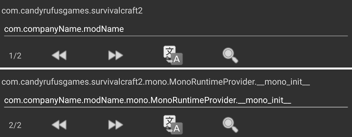

title: Android基础教程
#Android基础教程

>本教程由百度贴吧-<a href="http://tieba.baidu.com/home/main/?un=销锋镝铸" target="_blank">销锋镝铸</a>编写

##所需工具
* Android 2.3及以上设备
* [游戏安装包](#_2)
* 任意可编辑APK的软件，例如[MT管理器][1]、[APKCrack][1]，这里以操作更简单的[APKCrack][1]为例

##获取游戏
###正版途径
<a href="http://play.google.com/store/apps/details?id=com.candyrufusgames.survivalcraft2" target="_blank">Survivalcraft2 on Google Play</a>  
<a href="https://www.amazon.com/Candy-Rufus-Games-Survivalcraft-2/dp/B01N6GTF7M" target="_blank">Survivalcraft2 on amazon appstore for Android</a>  
>均为3.99美元，请支持正版！

###其他途径
<a href="http://m.appchina.com/app/com.candyrufusgames.survivalcraft2" target="_blank">Survivalcraft2 on 应用汇</a>  
<a href="https://tieba.baidu.com/p/5554414557" target="_blank">mod插件版</a>
>mod插件版可将Mod文件放至`/Survivalcraft/Mods`而不是安装包中进行加载，可大大提高在Android平台开发速率，链接内有使用教程

!!! warning ""
    以下和之后教程中的游戏Android版都是上述原版

###提取安装包
通过以上方式获取游戏后可能安装包未被下载工具保留，有以下两种方法提取：
####已root设备
使用支持root的文件管理器（例如[ES文件浏览器][1]）转到根目录后，进入`/data/app/`后，根据安卓版本不同：

* 如果都是文件则直接复制`com.candyrufusgames.survivalcraft2.apk`
* 如果都是文件，则进入`com.candyrufusgames.survivalcraft2-1/`文件夹，复制里面的`base.apk`

转到任意你认为方便的文件夹，粘贴。
####通用
使用任意无需root的安装包提取工具提取，这里以[ES文件浏览器][1]为例详细讲解  

1. 点击左上角菜单键弹出侧边栏；依次点击`库`，`应用`
2. 长按`Survivalcraft 2`，点击`备份`，弹出提示`…… 已成功`
3. 依次点击左上角`用户已安装应用`，`已备份应用文件`；长按`Survivalcraft 2_2.xx.xx.xx.apk`，点击`复制`
4. 从右向左滑动屏幕，进入任意你认为方便的文件夹，粘贴

!!! hint ""
    以下教程以操作较为简单的[APKCrack][1]为例  
    此教程使用的游戏安装包版本是2.1.14
    
##安装包结构
安装包内部分文件和文件夹说明：

* `assemblies/` 游戏动态链接库（**dll**）文件夹，添加新dll教程见[“源代码”教程][7]
    * `Engine.dll` 游戏作者开发的游戏引擎，一般不需要修改
    * `Survivalcraft.dll` 游戏主dll，可通过[dnSpy][2]修改“源代码”。详细修改教程见[“源代码”教程][3]
* `assets/Content.pak` 包含游戏 **数据**（例如方块属性、生物属性、合成表）和 **资源**（例如图片、声音、模型）的简单打包文件，可使用[SCPaker][4]解包后修改，此文件详细解析见[Content解析][5]
* `res/` 游戏桌面图标文件夹，三个不同分辨率的文件夹内图标都要替换成与其分辨率一致的图标
* `AndroidMainfest.xml` 安装包信息，可修改游戏名称、包名，下有教程[制作共存][6]

##增加文件
1. 使用[APKCrack][1]找到游戏安装包  

  
2. 点击上图中游戏安装包`Survivalcraft 2_2.1.14.0.apk`，弹出如下窗口，点击`查看`  

  
3. 进入到安装包中想添加文件的位置，点击如下所示的右上角图标，最后在弹窗中点击你要添加的文件即可

  
4. 如果无法安装，请先尝试卸载已安装的游戏，再重新安装，注意备份游戏存档
5. 如果以上步骤后仍然无法安装，点击第2步图中的`签名`，弹出窗口，点击`签名`，安装新出现的安装包`Survivalcraft 2_2.1.14.0_sign.apk`
6. 如果以上步骤后仍然无法安装，说明该文件夹已损坏，建议使用最后一次能正常安装的安装包重新以上步骤

##修改文件
步骤基本和[增加文件][#_8]一致，不同点在于第3步：  
依次点击安装包中要被替换文件右侧的方框`□`，右上角三点，`替换`，最后在弹窗中点击你要替换的文件即可

  

  
**或** 长按安装包中要被替换文件，弹出如下窗口，`替换`，最后在弹窗中点击你要替换的文件即可

  

##测试和发布
###测试运行
按照以上步骤修改或增加文件进游戏后，安装后打开来测试游戏是否可以正常运行，Mod是否生效。  
###出现错误

1. 安装包无法安装，根据不同报错有相应的解决方法：
    * `解析包错误` 安装包文件、结构损坏，请使用可正常安装的安装包重新修改
    * `签名不一致` 卸载已安装版本再安装；或[安卓核心破解][8]后直接安装
    * `应用未签名` 若要对安装包进行签名，在[APKCrack][1]中依次点击要安装的安装包，`签名`，`签名`，`×（关闭按钮）`，`（原安装包文件名）_sign.apk`，`安装`；或[安卓核心破解][8]后直接安装
2. 游戏闪退，可能是因为修改后的Content.pak损坏，或添加、修改的dll存在问题。  
3. 游戏弹出窗口报错，按照报错内容检查你的修改后修复即可  

对于原因不明的无法运行，比较一般的解决方法是将最后一次正常运行以来的修改全部删除，一点点加回去测试游戏，即可查出是哪一部分导致的问题。
###制作共存
 共存是指安装时不会覆盖原版，玩家可以不用卸载原版就能安装游戏。制作共存的原理是修改安装包的 **包名**（Package Name），以下以[APKCrack][1]为例进行说明

1.  依次点击上一步得到的安装包，`查看`，`AndroidManifest.xml`
2. 以本例使用的安装包，左下角显示总页数有两页，两页各有一处需要修改，如下图所示：  

  
上图中两个`com.candyrufusgames.survivalcraft2`是原包名，他们下面横线上手动输入的`com.companyName.modName`是要改成的示例包名，可更换。
3. 依次点击`返回键`，`确定`，左上角返回，此时安装包已经修改完成。而新生成的（原安装包文件名）.apk.bak是修改前的安装包备份。

!!! note "修改游戏名称"
    类似的，在第二页`Survivalcraft 2`下方横线上填入你想要的游戏名称，即可修改游戏为你想要的名称
    
##安卓核心破解
通过安卓核心破解，可以在安装安装包时无视签名，也就是说即使没有签名或签名不一致均能直接安装。这里以[幸运破解器][9]的 **root** 方式为例

!!! warning "操作有风险！"
    此操作可能导致手机无法开机，需要重刷系统解决，操作前请将设备数据备份！

1. 打开幸运破解器，依次点击底栏`工具箱`，`Android核心破解`
2. 勾选`签名验证始终真实`，点击`应用`，等待手机重启（耗时长）
3. 重复步骤1，勾选`禁用ZIP签名验证`，点击`应用`，等待手机重启（耗时长）
4. 重复步骤1，勾选`禁用应用管理器签名验证`，点击`应用`，等待手机重启，完成

完成后`Android核心破解`的弹出菜单如下图

  

[1]: resources.md#apk
[2]: resources.md#_12
[3]: source_code_tutorial.md
[4]: resources.md#contentpak
[5]: content_tutorial.md
[6]: #_11
[7]: source_code_tutorial.md#待补充
[8]: #_12
[9]: resources.md#_8