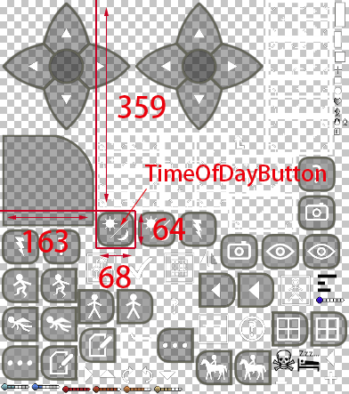

title: Content解析
#Content解析

>本教程由百度贴吧-<a href="http://tieba.baidu.com/home/main/?un=销锋镝铸" target="_blank">销锋镝铸</a>编写  

##前言
在之前的[Android基础教程][1]和[Windows基础教程][2]中，讲到了游戏的安装包或安装目录都存在一个Content.pak，是一个包含游戏 数据（例如方块属性、生物属性、合成表）和 资源（例如图片、声音、模型）的简单打包文件  
可以使用[SCPaker][3]对它解包，也可以用该软件将文件夹打包成新的Content.pak，本教程使用的软件亦是[SCPaker][3]。  Windows版[SCPaker][3]使用教程已在[Windows基础教程][2]中说明，Android版则拥有图形界面，因此该软件使用方法不再此教程复述。  
本教程将对解包出来的文件做一个简单的介绍，针对重要文件的详细说明将在之后的篇章讲解。

##根目录文件

* `BlocksData.txt` 存储了所有方块的大部分属性的类csv文件（以纯文本形式存储表格数据，使用特定的符号分隔字段），可直接用文本编辑器打开并编辑，详细修改教程见[BlocksData解析][4]
  
    !!! note "csv文件"
        以纯文本形式存储表格数据，使用特定的符号（该文件`;`）分隔字段  
        可使用<a href="https://products.office.com/zh-cn/excel" target="_blank">Office Excell</a>打开
      
* `Clothes.xml` 存储了所有衣物数据的xml文件，可直接用文本编辑器编辑，详细修改教程见[Clothes解析][5]

    >所有xml文件均可直接用文本编辑器编辑，建议使用支持代码高亮的文本编辑器

    !!! danger ""
        阅读任何xml文件详细修改教程前请务必阅读[XML教程][6]

* `CraftingRecipes.xml` 存储了所有合成表的xml文件，详细修改教程见[CraftingRecipes解析][7]
* `Database.xml` 存储了所有动物（还有主角、船等实体）的大部分属性的xml文件，在“源代码”中新添加的`Subsystem`、`Component`子类也需要在此文件中注册，详细修改教程见[Database解析][8]
* `Help.xml` 存储了游戏自带帮助内容（游戏主页-`Help`）的xml文件
* `NewWorldNames.txt` 存储了新建世界时随机出现的世界名的文本文件，每行一个世界名
* `RecoveryProject.xml` 每个存档内都有一个`Project.xml`，当存档内该文件损坏时，`RecoveryProject.xml` 将替换它
* `Strings.xml` 存储了调整设置时显示的帮助文本的xml文件

##文件夹
###界面贴图
`Atlas/` 文件夹有以下两个文件

* `AtlasTexture.png` 存储了一些主要的操作界面的贴图，例如方向键和按钮
* `Atlas.txt` 上述贴图文件的配置文本，每行定义了一个贴图，这里以其中一行为例进行说明：

```
TimeOfDayButton 163 359 68 64 0 0 0 0
```

| 序号 | 内容 | 说明 | 
| :-: | :-: | - | 
| 1 | TimeOfDayButton | 贴图名称 |
| 2 | 163 | 水平开始位置 |
| 3 | 359 | 垂直开始位置 |
| 4 | 68 | 水平宽度 |
| 5 | 64 | 垂直高度 |
| 6~9 | 0 | 无意义 |

示意图如下：  


###音频
`Audio/` 存储了所有音效文件的文件夹，可通过文件名知道是什么的音效  
`Music/` 存储了所有菜单界面的音乐文件的文件夹，目前共六首

###界面布局
`Dialogs/` 存储了所有对话框（黑色背景）的布局文件，格式xml  
`Screens/` 存储了所有全屏界面的布局文件，格式xml  
`Widgets/`存储了所有弹出窗口（灰色背景）和常使用的界面部件的布局文件，格式xml  
`Styles/` 存储了大部分按钮的布局文件，格式xml  
>以上界面布局文件的语言和 **XAML** 非常相似，它是xml的一个子集，通常用在`Windows Presentation Foundation（WPF）`。<a href="https://docs.microsoft.com/zh-cn/dotnet/framework/wpf/advanced/xaml-syntax-in-detail" target="_blank">点击此处查看官方文档</a>  
在？？？[提高箱子格数mod例子][9]中将有更详尽的说明

###模型
`Models/` 存储了所有3D模型，格式dae，可使用`3ds Max`等支持编辑dae的建模软件进行编辑

###贴图
`Textures/` 储存了大部分游戏贴图，格式为png，可使用`Photoshop`，[`像素小画家`][10]等软件编辑。为和常用词`方块材质`区分，称非`方块材质`的图片为贴图，以下是该文件夹下部分文件夹和文件说明

* `Clothing/` 存储了所有衣物、盔甲的贴图
* `Creatures/` 存储了所有生物的贴图
* `Gui/` 在上面`Atlas`文件夹中未整合到`AtlasTexture.png` 的操作界面贴图都在此文件夹
* `Blocks.png` 方块材质文件

###其他
`Shaders/` 存储了所有的渲染器程序，相关教程待补充  
`Fonts/` 存储了所有字体文件，和`Altas`文件夹相似，每个字体由一个图片文件和一个对应的配置文本，编辑贴图文件可使字体发生变化


[1]: android_tutorial.md
[2]: windows_tutorial.md
[3]: resources.md#apk
[4]: blocksdata_tutorial.md
[5]: clothes_tutorial.md
[6]: xml_tutorial.md
[7]: craftingrecipes_tutorial.md
[8]: database_tutorial.md
[9]: ../other_tutorial/expand_backpack_example.md
[10]: resources.md#_7